# UnderDaC

## Introduction
UnderDaC is a small restaurant chain focusing on seafood with each restaurant focusing on a particular major ocean. On the website you are able to reserve tables and place ordersfor pickup or delivery, the user is also able to create an account for faster booking and checkout. All information that is saved to the database will be readable, editable, updateable and deletable by the creator and/or the admin accounts. 

## Showcase
Picture of website on different devices

### Live Website
A deployed link to the website can be found [here](https://underdac.herokuapp.com/)

# Table of Contents
- [Table of Contents](#table-of-contents)
- [Introduction](#introduction)
- [Credits](#credits)

## Design

### Wireframes

 

  
Click here to view all wireframes for desktop:

  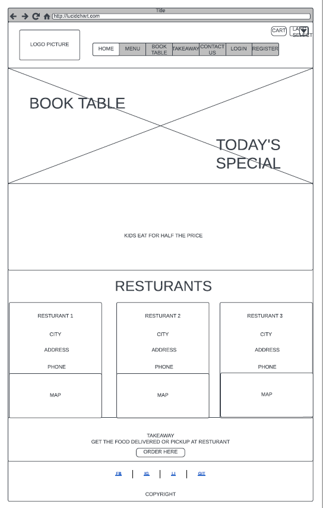
  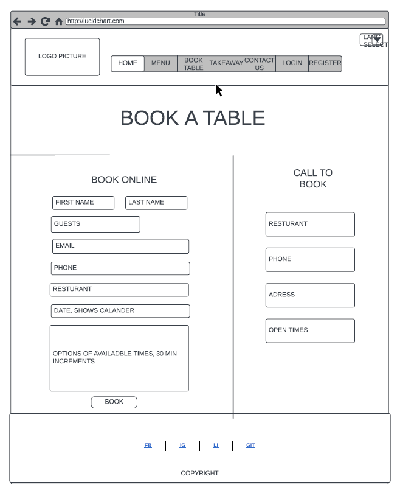
  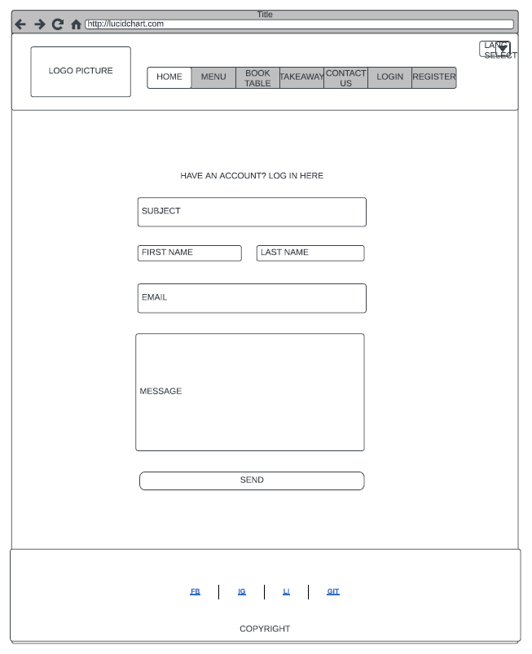
  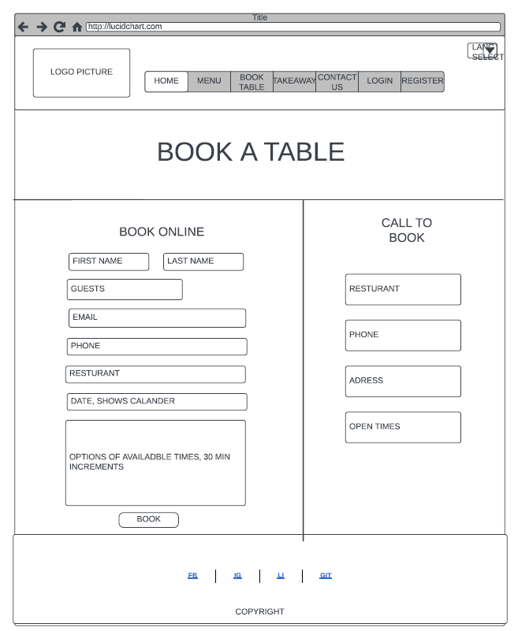
  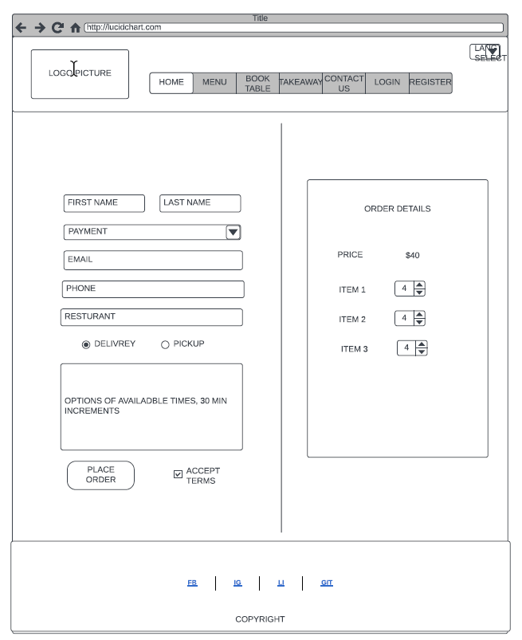
  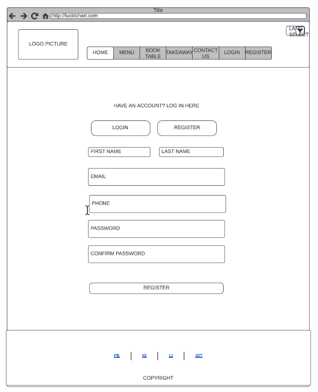
  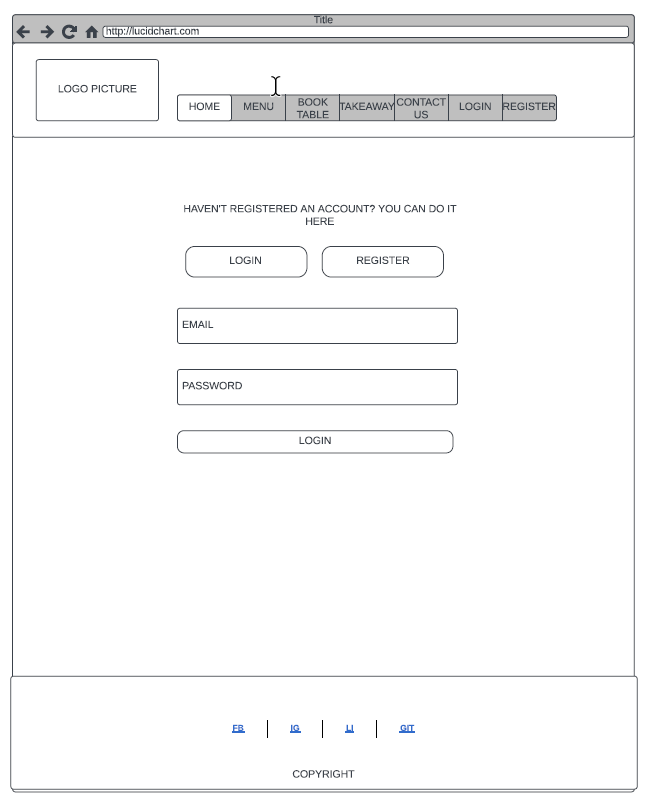

  

### Database

I made multiple tables for the website; Customer, Restaurant, MenuItem, Booking, Order, OrderItem, DeliveryInfo and Contact. 

The Customer table is used for storing additional customer information upon user registration.

The Restaurant table stores information about the restaurants; name, phone, address, image, open-hours, and a map number for getting the correct map on the home page

The MenuItem table stores information about menuitems; category, name, description, price, image, and as well a function to calculate half price

The Booking table stores information about table reservations customers are making; customer as a ForeignKey with a relationship to User, first name, last name, phone, email, restaurant as a ForeignKey with a relationship to the Restaurant table, guest count, date and time

The Order table stores information about an order made by a customer; customer as a ForeignKey with a relationship to User, restaurant as a ForeignKey with a relationship to the Restaurant table, delivery time, created on, wheather the order is completed, and wheather the order should be delivered. It also has a function for getting cart count and a function for calculating cart total.

The OrderItem table is used for relating an item to an order; item as a ForeignKey with a relationship to MenuItem, order as a ForeignKey with a relationship to the Order table, quantity. It also has a function for calculating the item price by the quantity.

The DeliveryInfo table is used for storing an order delivery information; customer as a ForeignKey with a relationship to the User table, order as a ForeignKey with a relationship to the Order table, first name, last name, address, city and created on.

The Contact table stores messages regarding whatever the customer wants to tell or ask the company; customer as a ForeignKey with a relationship to User, email, subject, message

  
Click here to view the ERD:

  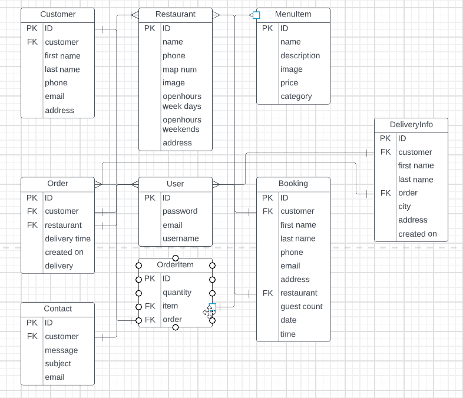

# Features
## Existing Features

### Navbar
The main navbar contains a logo, a top navbar and a bottom navbar. If the user is logged in, then the top navbar contains a logout button, a profile button, and if the user has an active booking it also displays a notification to remind the user of the upcoming reservation. If the useris not logged in it will display a login and a sign up button. And wheather or not the user is logged in it will always display the language selction and a cart. The bottom navbar contains links to all the main pages of the site; Home, Menu, Booking Table and Contact Us.

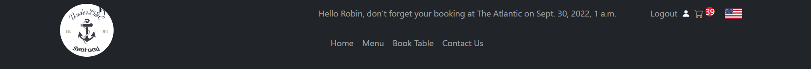

### Footer 
The footer contains copyright information and links to social media

### Home Page
The home page displays a two sections; one for offers and specials and the other for restaurant info. The first section has two banners. The first banner has two links, the first link says "Today's special" and goes to the menu page, and the second link says "Book a table" and takes the user to the table booking page. The second banner displays an offer that says that "Kids eat for half price". The restaurant section that shows each restaurant's details and also has a dropdown that shows the restaurants locations on a map.

### Menu Page 
The menu page displays all menu items seperated by the categories Menu, Vegan menu and kids menu. The admin can add as many items as they want and the page will accomadate for it. Each menu item has an "add to order" button.

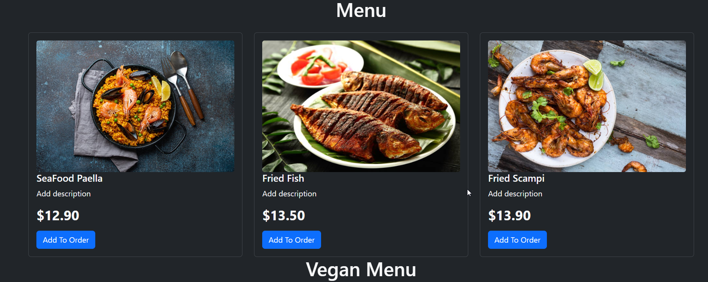

### Book Table Page
The book table page has at the top a row of buttons that each take the user to the respective restaurant booking page. The page displays a large image of the restaurant and benath it all the current reservations the user has for this particular restaurant  and beneath that a form for reserving a table. Next to the form there is a phone number so that the customer can reserve a table by phone. Beneath that there is information about the restaurants address and its open hours.

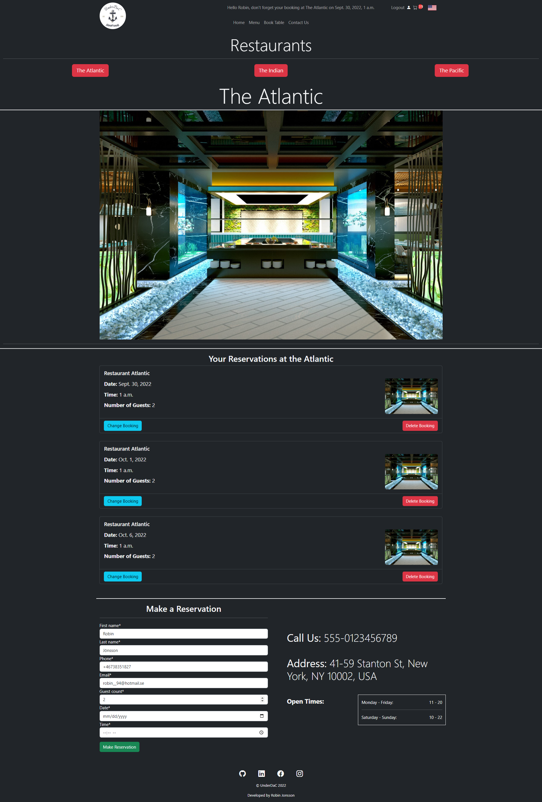

### Contact Us Page
This page has a form for anyone to message the company's about questions or complaints

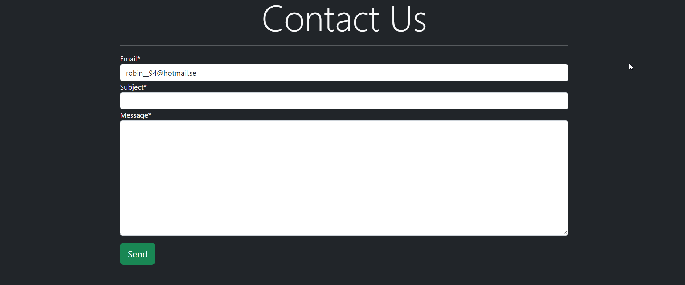

### Cart Page
This page shows a summary of everything the customer has added to their order, and a checkout button that takes the user to the checkout page. The user has the ability to add or subtract from the menu items they've added.

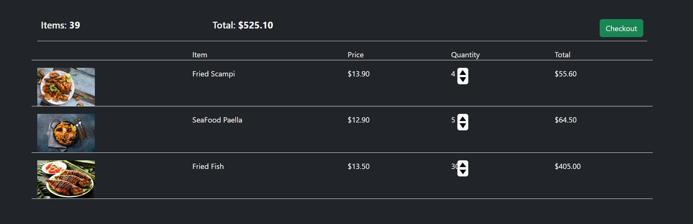

### Checkout Page
The checkout page displays a summary of the order before the customer finally makes the purchase. The customer can choose restaurant and pickup/delivery time, they can also choose to get the order delivered or if they rather want to pick it up at the restaurant, if they want it delivered they need to fill out their city and address as well. When everything is filled out the can click the conrinue button that will then display payment options.

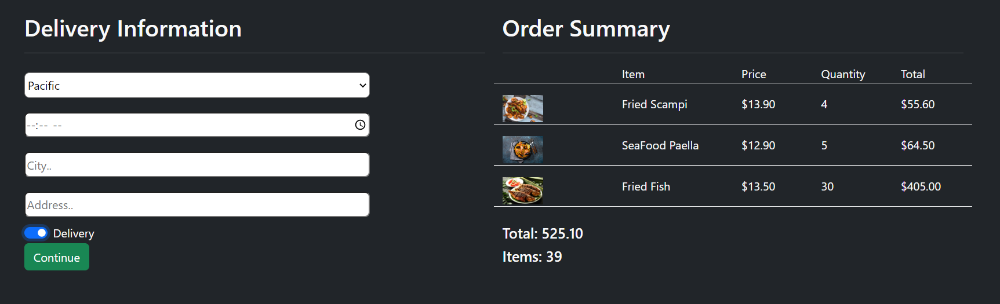

### My Reservations
This page is reached through the profile button in the navbar. The page will display all bookings that the customer has across all the restaurants. Here the user can edit or delete their reservations

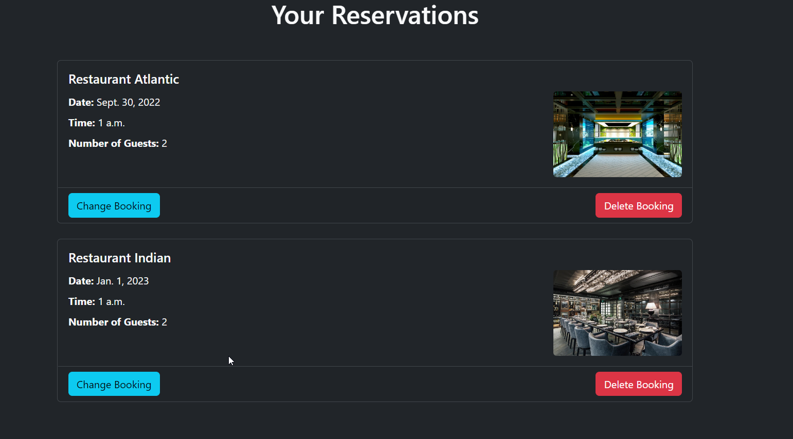

### My Details
Here the user can edit their information or delete their account 

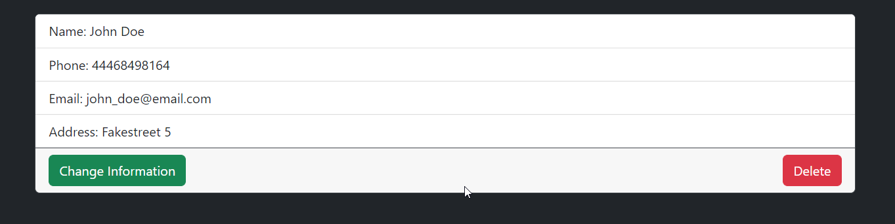

### Signup Page
Here the user is asked to fill out a form and upon submiting will save their profile to the data base and be logged in

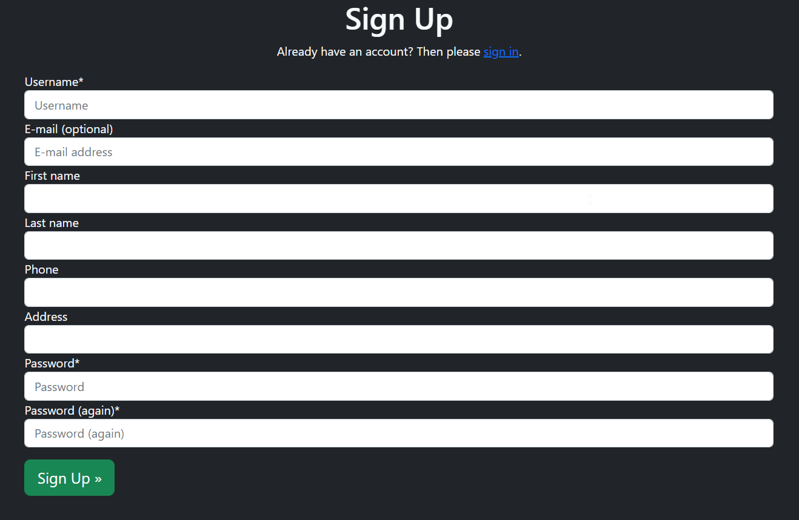

### Login Page
Here the user will fill out username and password, if the username and password are correct the user will be logged in. If they are not correct the user will be notified that the username or password is not correct.

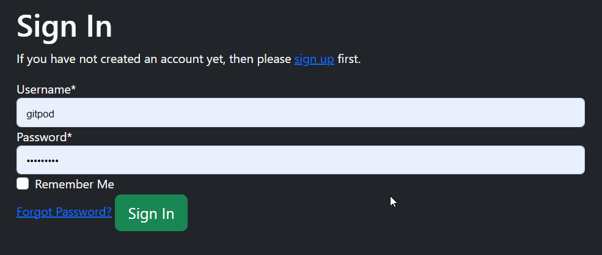

### Logout Page
After the user has clicked the logout button they will be taken to the logout page which will ask the user if they are sure they want to logout. If they click "Sign out" they will be logged out.

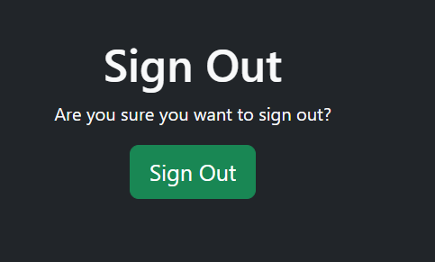

### Notifications
After any action that is sent from the user the user will get a notification at the top of the page. Notifications exist for: Adding to order, signing up, logging in, logging out, making, updating and deleting a reservation,  updating and deleting an account, making invalid reservations, upon sending a "contact us" message.

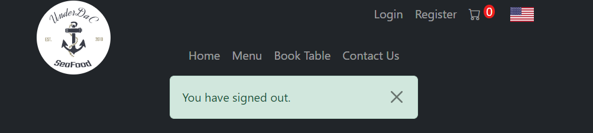

### Reservations
After a reservation has been made the inputed email in the reservation will recive an email confirmation.

### Language selection
The user can select the page language in the top right corner of the navbar. Upon clicking a dropdown of the language options will appear.

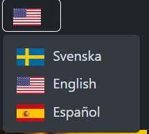

## Technologies Used
### Languages Used
  * [HTML5]
  * [CSS3]
  * [JavaScript]
  * [Python]

### Frameworks, Libraries & Programs Used
* [amiresponsive](http://ami.responsivedesign.is/) to see how responsive the site is on different devices.
* [LucidChart](https://lucidchart.com/) was used to create the Wireframes.
* [MapBox](https://www.mapbox.com/)) was used to for generating maps.
* [Cloudinary](https://cloudinary.com/) was used to upload, store, manage, manipulate, and deliver images.
* [Django](https://www.djangoproject.com/) was the framework used for this project
* [Bootstrap 5](https://getbootstrap.com/)) was used for icons and most styling on the site
* [Git](https://git-scm.com/) was used for version control by utilizing the Gitpod terminal to commit to Git and Push to GitHub.
* [GitHub](https://github.com/) Used to store the projects code after being pushed from Git.
* [Gitpod](https://www.gitpod.io/) Used to write my code.
* [Google Chrome Dev tools](https://developer.chrome.com/docs/devtools/) for debugging.
* [Google Lighthouse](https://developers.google.com/web/tools/lighthouse) used for audits to measure the quality of web pages.
* [Heroku](https://www.heroku.com/) used to deploy this app.
* [ShareX](https://www.sharex.com/) Images for this project were sourced from ShareX.
* [a11y](https://color.a11y.com/) Color Contrast Accessibility Validator.

## Testing

### Validation Testing
|  | Validations |  Pass/Fail |
| ------------- |-------------|  :----: |
| Chrome   | Lighthouse Report | Pass |
| HTML   | W3C Markup Validator | Pass |
| CSS   | W3C CSS Validator | Pass |
| Python   | PEP8 online | Pass |
| JS   | JSHint | Pass |
| Color Contrast   | a11y | Pass |

### Lighthouse Report
* Ran Lighthouse reports audits to gauge performance, accessibility, and SEO.

### The W3C Markup Validator
  

  
Checked using W3C Markup Validator ensuring there were no errors or warnings present. Click here to see the W3C Markup Validator result

  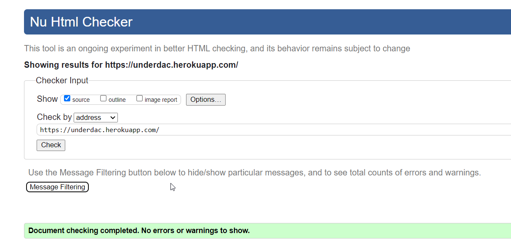

  

### W3C CSS Validator
  

  
Checked using W3C CSS Validator ensuring there were no errors or warnings present. Click here to see the W3C CSS Validator result

  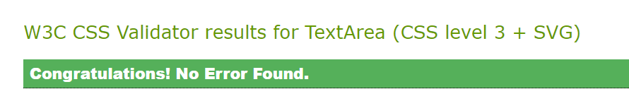

  

  ### PEP8 online 
  
Checked Python code is formatted according to the PEP 8 standards

  ### JSHint 
  
I used JSHint to validate the JavaScript

   ### Color Contrast Accessibility Validator 
  

  
Checked color contrast analysis accessibility

  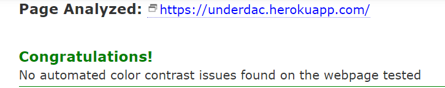

  
 

### Manual Testing
* Manual testing was completed for each case and edge case scanerio
* The site was also manually tested on various browsers (Google Chrome, Safari, Microsoft Edge and Firefox.) and on different screen sizes.
* Dev tools was used often to identify errors within HTML and CSS code, with the console feature to identify errors in Javascript code.
* I also used lighthouse reports to see the performance, quality, and correctness of the website.

### Scenerios and results
|   | Pass/Fail |
| ------------- | :----: |
| Clicking the navbar logo homepage takes the user to the homepage  |  Pass |
| Clicking menu in the navbar takes the user to the menu page   |  Pass |
| Clicking book table in the navbar opens a dropdown with restaurant options that each takes the user to the corresponding restaurant's booking page    |  Pass |
| Clicking contact us in the navbar takes the user to the contact page   |  Pass |
| Clicking the profile icon in navbar opens a dropdown with two options (my reservations and my details) that each takes the user to the corresponding page   |  Pass |
| Clicking the cart icon in the navbar takes the user to the cart page   |  Pass |
| Clicking the booking notification in the navbar takes the user to the my bookings page   |  Pass |
| Clicking checkout in the cart page takes the user to the checkout page   |  Pass |
| Clicking logout in the navbar page takes the user to the signout page   |  Pass |
| Clicking login in the navbar page  takes the user to the login page   |  Pass |
| Clicking register in the navbar page takes the user to the signup page   |  Pass |
| Clicking the map buttons in the home page opens a map of the restaurants address   |  Pass |
| Clicking book table on the home page banner takes the user to the restaurant booking page   |  Pass |
| Clicking today's special in the home page  takes the user to the menu page    |  Pass |
| Clicking the name of each restaurant in the home page restaurant display takes the user to the corresponding restaurant booking page   |  Pass |
| Clicking each social media link in the footer opens a new tab and takes the user to the corresponing social media webpage   |  Pass |
| Clicking the flag button in the navbar opens up a dropdown of language selections   |  Pass |
| Clicking add to order on a menu item adds the item to the cart and updates the cart count   |  Pass |
| Clicking the different restaurant buttons on the restaurant booking page takes the user to the corresponding restaurant booking page   |  Pass |
| Clicking change booking on a reservation in the restaurant booking page loads the corresponding form of the booking prepopulated with the details of that booking, and a notification appears on top of the page     |  Pass |
| The reservation form on the restaurant booking page is prefilled with the user information if the user is logged in    |  Pass  |
| Clicking delete booking on a reservation in the restaurant booking page deletes it from the page and from the database, and a notification appears on top of the page     |  Pass |
| Filling out the form in the restaurant booking page and then clicking "make reservation", if the form is valid and the booking isn't closer than 3 hours from another booking in the same restaurant with the same user, the booking is saved to the data base, an email confirmation is sent to the email submited and the booking will appear on the restaurant_booking page and in the my reservations page. A notification appears on top of the page     |  Pass |
| Filling out the contact form in the contact page and clicking send, if the form is valid i gets saved to the database, and a notification appears on top of the page    |  Pass |
| If the user is logged in, the email field in the contact form is prefilled    |  Pass |
| Clicking change quantity arrows in the cart page updates the item's quantity. If the quantity goes to 0 the item is removed from the cart   |  Pass |
| Clicking delivery button displays extra form fields to fill out   |  Pass |
| Not having any active reservations doesn't display the notification in the navbar    |  Pass |
| Being logged in displays the profile icon and the logout button. Not being logged displays the login and the resgister buttons in the navbar    |  Pass |
| Bookings can be made as a non-registered user    |  Pass |
| Adding items to cart as a non-registered user    |  Fail |
| Viewing items on cart page as a non-registered user    |  Fail |
| Cheking out as a non-registered user    |  Fail |
| Ability to translate page with the language select options    |  Fail |

### Responsiveness Browser Compatibility

|  | Chrome | Firefox | Edge | Safari | Pass/Fail |
| ------------- |-------------| -----|  ---------- |  -----| :----: |
| Expected Appearance   | yes | yes  | yes  | yes | Pass |
| Expected Layout   | yes | yes  | yes  | yes | Pass |

## Media
- Home page specials picture from https://www.iheart.com/content/2022-02-08-this-san-dimas-restaurant-has-the-best-seafood-in-southern-california/
- Home page kids offer picture from https://www.renfrewshire24.co.uk/2021/04/23/kids-give-their-opinion-on-new-redhurst-hotel-junior-menu/
- Home page restaurant 1 picture from https://www.tippleandbrine.com/easy-steps-choose-great-seafood-restaurant/
- Home page restaurant 2 picture from https://quark-studio.com/portfolio/seafood-restaurant/
- Home page restaurant 3 picture from 
- Menu-item-1 and Menu-item-2 from https://www.istockphoto.com/se/search/2/image?phrase=fish+fry+india
- Menu-item-3 from https://restaurantclicks.com/most-popular-seafood-dishes/
- Menu-item-4 from https://hipfoodiemom.com/2019/05/22/seafood-recipes-for-summer-a-video/
- KidsMenu-item-1 from https://www.delish.com/cooking/recipe-ideas/recipes/a53296/easy-fish-taco-recipe/
- KidsMenu-item-2 from https://dizzybusyandhungry.com/crab-cake-on-a-bun/
- KidsMenu-item-3 from https://ishavet.nu/receptbank/recept/fish-n-chips/
- Veganmenu-item-1 from https://www.pinterest.se/pin-builder/?url=https%3A%2F%2Favegtastefromatoz.com%2Fvegan-simple-seafood-pasta%2F&media=https%3A%2F%2Favegtastefromatoz.com%2Fwp-content%2Fuploads%2F2019%2F06%2FSeafood-Pasta-Close-Up.jpg&description=Vegan+Simple+Seafood+Pasta+-+a+Veg+Taste+from+A+to+Z&method=button
- Veganmenu-item-2 from https://www.pinterest.se/pin-builder/?url=https%3A%2F%2Favegtastefromatoz.com%2Fbest-vegan-salmon%2F&media=https%3A%2F%2Fi0.wp.com%2Favegtastefromatoz.com%2Fwp-content%2Fuploads%2F2021%2F03%2Fcarrot-lox-side.jpg%3Fresize%3D1170%252C1755%26ssl%3D1&description=best+vegan+salmon+%2F+carrot+lox+close+up+on+a+wooden+tray+with+lemon+wedges%2C+capers+and+dill&method=button
- Veganmenu-item-3 from https://nutriciously.com/vegan-fish-seafood-recipes/

## Credit
- Tech with tim
- Dennis Ivy 
- Pretty printed 
- Caleb Curry 
- The net ninja

- getCookie function in base.js taken from https://www.w3schools.com/js/js_cookies.asp

## Bugs 
- Getting all cookies from a request 
- Closing the pop up message from before it the time out is over causes an exception because now there is nothing to close

## Fixed Bugs
- Static files doesn't get uploaded with heroku
- Could not deploy to heroku because the main folder "underdac" was called "UnderDaC" in the Procfile and the settings
- The maps wouldn't fit and resize inside the accordian as expected. The solution was to not specify a width and only specify the height of the map and also remove the padding of its container.
- Cart items were changing order when the quantity was changed with the quantity arrows. This was fixed by ordering them by id in the cart view